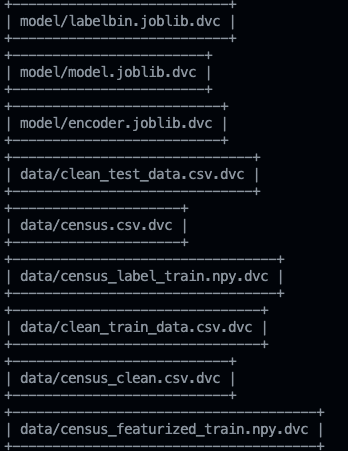
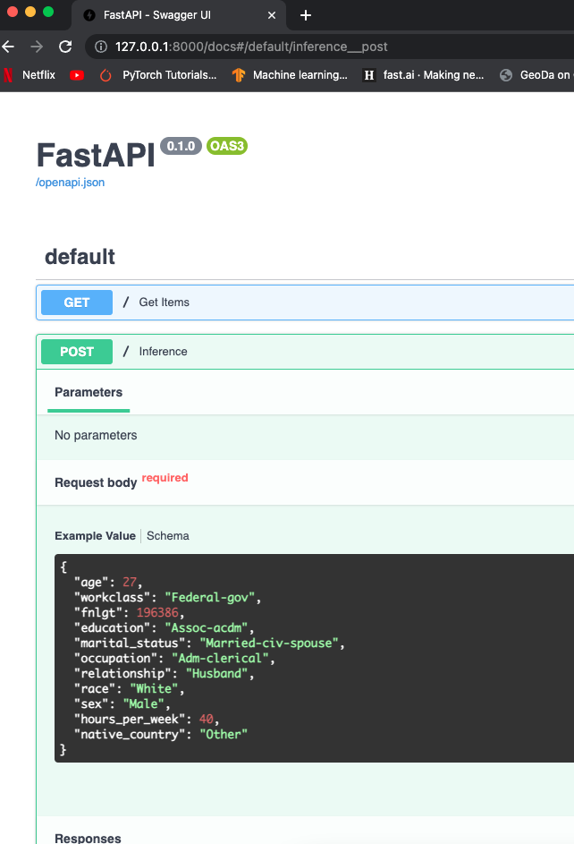

# Machine Learning Model CICD with Github Action and Heroku

This repository is collection of script to create Machine Learning Model with CICD process by using Github Action (CI) and Heroku (CD)

## Model Development Process

## Data 
Data for model development come from [Census Income Dataset](https://archive.ics.uci.edu/ml/datasets/census+income). This data set compose with 14 attibutes mixed with categorical data and numerical data. <br/>
For training dataset, 80% of data have been randomly selected.
Data for evalution is the same as training set, but remaining 20% of data is used for evaluation by slicing on each categorical features data.

## Model
GradientBoosting - Classifiers from [Scikit-Learn](https://scikit-learn.org/stable/modules/generated/sklearn.ensemble.GradientBoostingClassifier.html) with selected hyperparamerters as below list 
``` python
- n_estimators: 100
- learning_rate: 0.05
- min_samples_split: 500
- min_samples_leaf: 50
- max_depth: 8
```
### Metrics
Selected performance metrics is ```accuracy``` on KFold cross-validation with n = 10 on trainining data. <br/>
**Train Set : Accuracy** <br/>
```accuracy_mean``` = 0.842 and ```accuracy_std``` = 0.006 <br/>
**Test Set : Accuracy** <br/>
```accuracy_mean``` = 0.838 and ```accuracy_std``` = 0.012 <br/>

For full test data set, precision, recall, fbeta have been calculated. <br/>
**Train Set** <br/>
```Precision``` = 0.735, ```Recall``` = 0.611, ```FBeta``` = 0.667 <br/>
**Test Set** <br/>
```Precision``` = 0.711, ```Recall``` = 0.549, ```FBeta``` = 0.620

Full details of model can be found from model card.
* [Model Card](./model_card.md)

### Data Slicing Performance
Model evaluation is performed by slicing part of data to check performance consistency across each features.
* [slice_output.txt](./model/slice_output.txt)

## Testing
Test suite can be executed by `pytest` and it will compile all below script automatically.
```python
- test_data_cleaning.py
- test_preprocess_data.py
- test_train_model.py
- test_prediction_api.py
```


## DVC (Data Version Control)
DVC is setup with remote location at S3 AWS <br/>
Both in testing on CI and on CD when deployment, script will pull data from this remote dvc site. <br/>

### DVC dag in Repository



## CI/CD
Every step is automated on Pull Request [Test pipeline](.github/workflows/python-app.yaml) is triggered.
Pipeline pulls data from DVC and execute Flake8 + pytest doing every test case in this repository.


On Merge **Deploy Pipeline**, Heroku come to here in this part.<br/>
Trained model is used (ML Model, Encoder) from dvc remote location on with and Heroku will be able to automatically build the app.<br/>
Every pass testing from CI process will be automatically deploy to build API.


## API Deployment
For API creation process, [FastAPI](https://fastapi.tiangolo.com/) have been used.<br/>
Main application script is [prediction_api.py](./prediction_api.py) <br/>

### Example of API POST Schema
I have provied the example of schema for making POST request.


### Testing GET & POST from deployed API
Deployed API on heroku is below URL. <br/>
```https://census-income-prediction-gb.herokuapp.com/``` <br/>
To perform testing on this API, [check_deployed_api.py](./check_deployed_api.py) is used. <br/>
Running result of this script will testing GET and POST to API.

